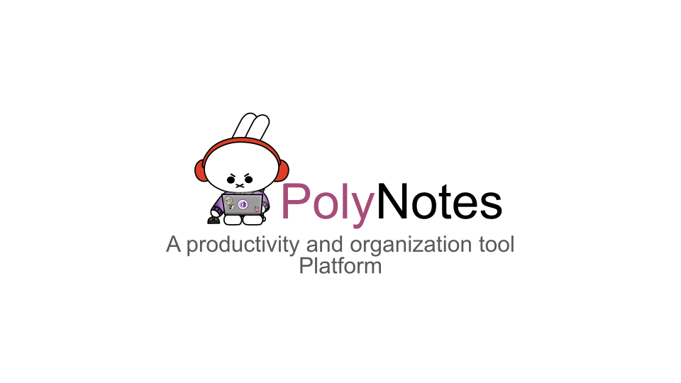
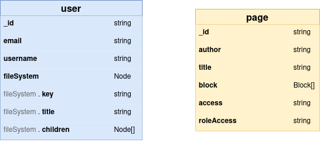
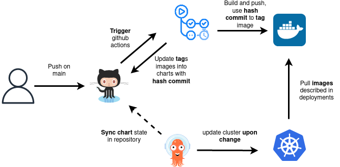
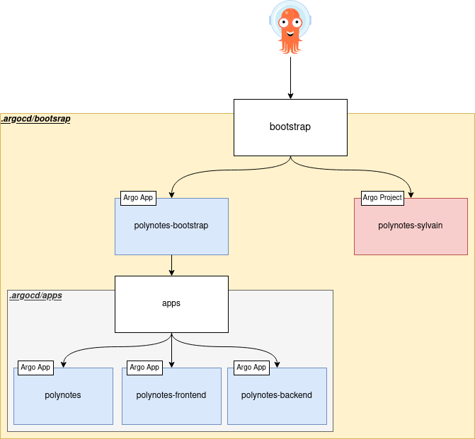
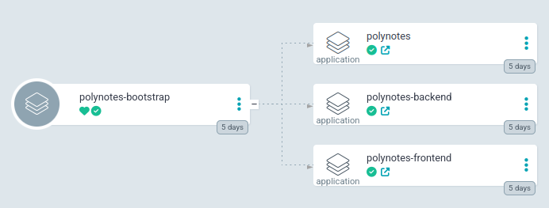

<p align="center">
    
</p>

[](https://wakatime.com/badge/user/068a54f9-253e-4c1c-b6bd-8c5eed569758/project/25985d0c-9b6e-4354-ad5d-c7832aac8857)

**PolyNotes** is a version 0 note-taking application that offers users the ability to create and organize their notes. The application revolves around the concept of a "note" which serves as the primary unit of content for PolyNotes. Each note can be individually created, edited, and organized according to the user's preferences. In addition, notes can be structured into multiple "blocks", which are modular units of content within a note. This allows users to visually structure their notes in a customizable and flexible format. With this core feature, PolyNotes provides an efficient and user-friendly platform for capturing and storing thoughts, ideas, and information.

## Table of contents

- [Table of contents](#table-of-contents)
- [Requirements](#requirements)
- [PolyNotes](#polynotes)
  - [Features](#features)
  - [Blocks](#blocks)
  - [Tech stack](#tech-stack)
    - [Frontend](#frontend)
    - [Backend](#backend)
    - [Database](#database)
- [Deployment](#deployment)
  - [Run locally](#run-locally)
  - [Production environment](#production-environment)
    - [CI/CD](#cicd)
    - [Cluster Bootstrapping : App of Apps Pattern](#cluster-bootstrapping--app-of-apps-pattern)
    - [Secrets](#secrets)
    - [Result](#result)
- [:page\_with\_curl: License](#page_with_curl-license)

## Requirements

To use this repo in its entirety, you will need the following:

Infrastructure:

- **Docker Hub** account
- A **Kubernetes** cluster
- **ArgoCD** and **Letsencrypt** installed on cluster
- Infrastructure managed by **Terraform** (or an equivalent tool). Note that installing without versioning is possible but deprecated.

Tools:

- Helm
- Docker compose

## PolyNotes

### Features

| Status | Feature                | Description                                                                                                                                                                                   |
| ------ | ---------------------- | --------------------------------------------------------------------------------------------------------------------------------------------------------------------------------------------- |
| ✅     | Note                   | Allows users to create, edit notes with a title and multiple blocks.                                                                                                                          |
| ✅     | Manifesto              | A landing page with a concise slogan that introduces PolyNotes.                                                                                                                               |
| ✅     | Authentication         | Enables users to register, login and logout with verification email and accepting the terms of use (ToU).                                                                                     |
| ✅     | ToU                    | Provides a page with the terms of use (ToU) that users must accept to use the application.                                                                                                    |
| ✅     | Profile                | A simplified user profile that includes only the user's name and a logout button.                                                                                                             |
| ✅     | Recent open documents  | Displays a list of recently opened documents in ascending order with the date of the most recent update.                                                                                      |
| ✅     | File Explorer          | Allows users to create notes or folders using a tree architecture, similar to a file system, which makes it easy to organize notes.                                                           |
| ✅     | Sharing content        | Enables users to share notes either publicly or privately. If a note is set to public access, the user can define whether anonymous users can only view the note or have editing permissions. |
| ❌     | Shared With Me         | Displays a list of notes shared with the user.                                                                                                                                                |
| ❌     | Search                 | Allows users to search notes by keyword.                                                                                                                                                      |
| ❌     | Trash                  | Provides a way for users to move notes to a trash folder and recover them if needed.                                                                                                          |
| ❌     | Stared                 | Allows users to bookmark or mark notes as favorites for easy access.                                                                                                                          |
| ❌     | Realtime collaboration | Enables users to collaborate on notes in real-time with other users.                                                                                                                          |
| ❌     | Page and folder delete | Allows users to delete pages and folders they no longer need.                                                                                                                                 |

### Blocks

| Block        | Description                                                                                  |
| ------------ | -------------------------------------------------------------------------------------------- |
| Text         | A block that allows users to add and format text using a rich text editor.                   |
| Heading      | A block that creates a heading or subheading to break up text.                               |
| Bullet list  | A block that creates a bulleted list of items.                                               |
| Ordered list | A block that creates a numbered list of items.                                               |
| To-do list   | A block that creates a list of tasks with checkboxes to mark them as complete or incomplete. |
| Sub page     | A block that allows users to link to another page or create a subpage within a note.         |
| Image        | A block that allows users to add an image to their notes.                                    |
| Database     | A block that allows users to add and display a database in either table or kanban view.      |

### Tech stack

The PolyNotes application is built using the following technologies:

| Category       | Technoligies                                                                                                                                                                                                                                                                                                                                                                                                                                                                                                                                                                                                                                                                                                                                                                                                                                                                                                             |
| -------------- | ------------------------------------------------------------------------------------------------------------------------------------------------------------------------------------------------------------------------------------------------------------------------------------------------------------------------------------------------------------------------------------------------------------------------------------------------------------------------------------------------------------------------------------------------------------------------------------------------------------------------------------------------------------------------------------------------------------------------------------------------------------------------------------------------------------------------------------------------------------------------------------------------------------------------ |
| Frontend       |  |
| Backend        |                                                                                                                                                                                                                                                                                                                                                                                                                                                                                                                                                                                                                                                                                |
| Database       |                                                                                                                                                                                                                                                                                                                                                                                                                                                                                                                                                                                                                                                                                                                                                                                                              |
| Infrastructure |                                                                                            |

#### Frontend

-  **React**

React was a requirement for the project. It can quickly become difficult to maintain the project's structure and readability without proper organization, since React is not a framework. However, React benefits from a strong community and follows a component-based architecture. Nevertheless, React can be more challenging to learn and use effectively compared to other component-based technologies.

-  **Redux**

Redux is a popular state management library for React, allowing for centralized state management. Reducers separate state-related logic and make state changes predictable, but the state behavior in the reducer can seem strange. A major weakness of reducers is that it's not possible to fetch data for the initial state, making their use more complicated.

-  **React-router-dom**

React Router DOM is a popular option for routing. However, it can be limited for more advanced features such as loading data when a route is used. Although React Router DOM version 6 offers some interesting features, personally, I don't consider it indispensable and I think other alternatives might be better depending on the project needs.

-  **Ant Design**

Ant Design is a React component library that provides ready-made components to create user interfaces, which is very handy. However, I find the documentation quite difficult to understand, as it lacks clarity. But fortunately, there are many concrete examples that help to better understand how it works and make it easier to use.

-  **Tiptap**

Tiptap Editor offers text editors that natively include markdown support. In addition to this feature, Tiptap offers the ability to create rich text as well as other components needed for a text editor. Although Tiptap is a popular library, it has a smaller community than other similar libraries, which can make problem solving more difficult. The "blocks" used to create PolyNotes are based on Tiptap's text editors.

#### Backend

-  **NestJS**

NestJS is a framework dedicated to API development, which aims to provide a fast and smooth development experience for developers. It offers many built-in services, such as mailer and Swagger, to make API creation easier. However, NestJS can seem complex, as it uses decorators and works "magically" by performing many operations automatically. In addition, even though it allows you to develop quickly, the API created with NestJS can be less powerful. Despite these drawbacks, NestJS is very popular with developers thanks to its active community and its speed of development.

The documentation is available [here](https://polynotes.cluster-2022-9.dopolytech.fr/api/documentation).

#### Database

-  **MongoDB**



The MongoDB database used for this project has three schemas: user, page and file system. The file system is a tree, whose child nodes represent pages, the `key` represents the `_id` of the pages. The relationship between the file system and the pages is one-to-many. On the other hand, the user schema and the file system are related in a one-to-one fashion.

```ts
interface Node {
  title: string;
  key: string;
  children?: Node[];
}

enum BlockType {
  TEXT = "text",
  IMAGE = "img",
  TABLE = "table",
  BULLET_LIST = "bullet-list",
  ORDERED_LIST = "ordered-list",
  TO_DO_LIST = "to-do-list",
  HEADING_1 = "heading-1",
  HEADING_2 = "heading-2",
  HEADING_3 = "heading-3",
  SUB_PAGE = "sub-page",
}

interface Block {
  id: string;
  content: string | null;
  type: BlockType;
}
```

For my project, I found that a document-oriented database like MongoDB would be a good fit due to its flexibility and scalability. It supports features like sharding and replication and has a simple and intuitive query language. It also allows for dynamic schema design that can handle changing data requirements over time.

However, I must be aware that MongoDB's flexibility may introduce complexity, and it may require careful management to ensure data consistency and integrity.

---

## Deployment

### Run locally

Navigate to the backend directory and create the `.env` file and complete it :

```env
MONGODB_URL=mongodb://mongo:27017/polynotes
BASE_URL_API=http://localhost:5000
BASE_URL_APP=http://localhost:3000
MAILER_HOST= ## smtp
MAILER_PORT=587
MAILER_USER= ## mail address
MAILER_PASSWORD= ## mail password
SECRETKEY= ## jwt secret
EXPIRESIN=5h
```

Finally, to run the project locally, navigate to the root directory and run the following command:

```sh
docker compose up
```

### Production environment

The production deployment is managed by ArgoCD, which is handled by helm.

#### CI/CD




#### Cluster Bootstrapping : App of Apps Pattern



ArgoCD is an open-source continuous deployment tool. This solution allows us to deploy and monitor applications on a Kubernetes cluster. It ensures the synchronization of a Git repository and deploys the associated Helm "chart(s)". A "chart" is a collection of files that describe a related set of Kubernetes resources. Thanks to its synchronization capability, ArgoCD is able to detect changes made to a chart, and deploy a new version of the application on the cluster accordingly.
The particularity of ArgoCD is the use of an "app of apps" type architecture. This is an approach used to group several applications under a single one. This "parent" application can then be deployed with all its children, or "child" applications. In this way, all applications can be deployed and managed in a consistent and efficient manner, while allowing a clear overview of all deployments on the Kubernetes cluster.

To deploy PolyNotes **in production**, use the helm chart located at `.argocd/bootstrap`. This will create the following resources:

- _polynotes-sylvain_ (ArgoCD Project)
- _polynotes-bootstrap_ (ArgoCD Application)

The `polynotes-bootstrap` application fetches the chart located at `.argocd/apps` and creates the resources listed below:

- _polynotes_ (ArgoCD Application)
- _polynotes-frontend_ (ArgoCD Application)
- _polynotes-backend_ (ArgoCD Application)

#### Secrets

In production, credentials are managed using Terraform. 

```terraform
resource "kubernetes_secret" "polynotes-sylvain" {
  metadata {
    name      = "polynotes-sylvain-pwd"
    namespace = "sylvain"
    labels = {
      managed-by = "terraform"
    }
  }

  data = {
    "mongodb-root-password" = ## MongoDb root password
    "mongodb-passwords"     = ## MongoDb root password
    "mongodb-url" = "mongodb://admin:<mongo-password>@polynotes-mongodb.sylvain.svc.cluster.local:27017/polynotes?authMechanism=DEFAULT&authSource=polynotes"
    "mailer-password" =  ## mailer password
    "secret-key" = ## jwt secret
  }

  type = "Opaque"
}
```

#### Result

Finally, in ArgoCD, you can see the deployed PolyNotes:



## :page_with_curl: License

This project is licensed under the [MIT License](LICENSE).

---

Made with :sparkling_heart: by [Sylvain Pierrot](https://github.com/sylvain-pierrot)
